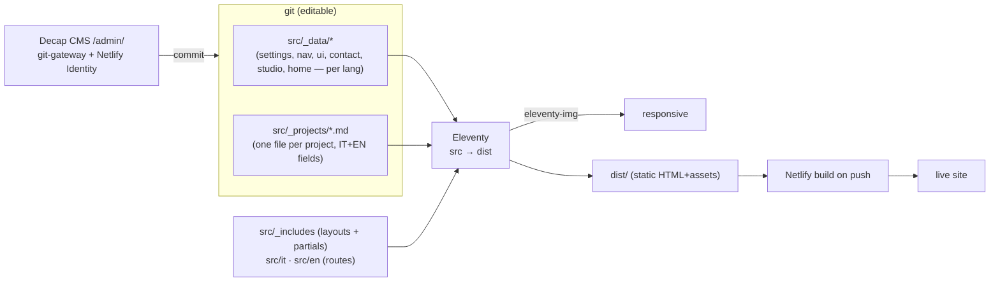

# PIANA — Roberto Piana studio site

> Canonical project reference, as-built (June 2026). Verified against source.

A **bilingual (IT-primary / EN) static site** for the architecture studio of **Roberto
Piana**, built with **Eleventy**, edited by a non-technical client through **Decap CMS**
(git-based), hosted on **Netlify**. Minimalist, photography-led, with a hand-drawn
"Roberto Piana" **signature intro** (GSAP) and smooth scroll (Lenis). It descends from a
StyleShout template but only the flexbox grid in `base.css` remains (see [§10](#10-caveats--gotchas)).

| Attribute | Value |
|---|---|
| Generator | Eleventy v3 (`src/` → `dist/`) |
| Languages | Italian at `/`, English under `/en/` |
| CMS | Decap CMS — git-gateway + Netlify Identity (email invite, no GitHub account) |
| Hosting | Netlify (primary); `gh-pages` is a fallback target |
| Fonts | ABC Arizona Flare Light (display + body) · DM Sans (labels/nav/tags) — self-hosted woff2 |
| Animation | GSAP (signature intro) + Lenis (smooth scroll), self-hosted/vendored |
| Images | `@11ty/eleventy-img` → responsive `<picture>` (AVIF/WebP/JPEG) |
| Accessibility | EN 301 549 / WCAG 2.1 AA — `make a11y` (pa11y-ci) 16/16 |
| Rendered routes | 16 page routes (IT+EN) + `/admin/`, `sitemap.xml`, `robots.txt`, `_redirects` |
| Status | Launchpad v1; deployed to a Netlify subdomain; not yet on the custom domain |

**I want to… →**
- run/edit locally → [Quick start](#quick-start)
- understand how a page is built → [§1 Mental model](#1-mental-model--how-a-page-is-built)
- find where content lives / edit copy → [§3 Content model & CMS](#3-content-model--cms)
- change colours/fonts → [§5 Design system](#5-design-system)
- understand the intro animation / JS → [§6 Front-end JS](#6-front-end-js)
- deploy / CMS login → [§8 Hosting & CMS auth](#8-hosting--cms-auth)
- know what's still fake/missing → [§10 Caveats](#10-caveats--gotchas) · [§11 Status](#11-status--launch-checklist)

---

## Quick start

```sh
make install   # install dependencies
make dev       # Eleventy dev server → http://localhost:8000
make cms       # local Decap CMS proxy (pair with `make dev`, open /admin/)
```

**Quality gates**

```sh
make lint      # html-validate + stylelint + eslint
make a11y      # WCAG 2.1 AA audit (pa11y-ci: axe + HTML_CodeSniffer)
make links     # broken-link crawl
make build     # optimized production build into dist/
```

`make` (no target) lists everything. Pipeline details in [§7 Build & tooling](#7-build--tooling).

---

## 1. Mental model — how a page is built

Content lives as **data/markdown in git**; Eleventy renders it into static HTML; the
client edits the same files through Decap CMS, which commits and triggers a Netlify build.



**Per-language data is folder-based:** `src/_data/settings/it.json` is exposed to templates
as `settings.it`, so a template reads `settings[lang]`, `nav[lang]`, `ui[lang]`, etc. `lang`
is set by directory data (`src/it/it.json` → `{lang:"it"}`, `src/en/en.json` → `en`).

---

## 2. Repository structure

```
src/
├── _data/                       # global + per-language content (folder = key)
│   ├── site.json languages.js   # site-wide config + language list
│   ├── settings/{it,en}.json    # brand: siteName, tagline, social, COLOURS, FONTS, homeHero
│   ├── nav/{it,en}.json  ui/{it,en}.json
│   ├── contact/{it,en}.json  studio/{it,en}.json  home/{it,en}.json
├── _projects/                   # CMS folder collection (one .md per project)
│   ├── NN-slug.md               # single-file i18n: title_it/en, description_it/en, gallery[], …
│   └── _projects.json           # { permalink: false } — data only, not rendered
├── _includes/
│   ├── layouts/base.njk         # <html>, head, header, {{content}}, footer, scripts
│   └── partials/                # head, header, nav, lang-toggle, footer, intro, logo-sign,
│                                #   lightbox, netlify-identity
├── it/  (→ /)                   # index, studio, contatti(+grazie), progetti(index+detail), 404
├── en/ (→ /en/)                 # mirror: index, studio, contact(+thanks), projects(index+detail), 404
├── assets/
│   ├── css/{base.css, app.css}  # base = vendored grid+normalize; app = design system
│   ├── js/app.js + modules/* + vendor/{gsap,lenis}.min.js
│   ├── fonts/  icons/  uploads/ # woff2; brand SVGs; CMS image uploads
├── redirects.njk sitemap.njk robots.njk   # → /_redirects, /sitemap.xml, /robots.txt
admin/{index.html, config.yml}   # Decap CMS
eleventy.config.js  Makefile  netlify.toml  package.json
```
Root favicons (`favicon.ico`, PNGs, `site.webmanifest`) + `admin/` are passthrough-copied.
The raw client delivery bundle (`assets/` at repo root) and `docs/` are **gitignored**.

---

## 3. Content model & CMS

Everything a non-technical editor changes is a data/markdown file, edited via **Decap CMS at
`/admin/`** (`admin/config.yml`). Backend `git-gateway` + Netlify Identity → email-invite
login, edits commit to the repo, Netlify rebuilds. Local editing without Netlify: `make cms`
(decap-server) + `make dev` (`local_backend: true`, localhost only).

| Content | File(s) | CMS collection | Notes |
|---|---|---|---|
| Projects | `src/_projects/NN-slug.md` | **Progetti** (folder, "New") | Bilingual fields in one file; `featured`, `draft`, `order`; gallery list |
| Home | `src/_data/home/{it,en}.json` | pages → Home IT/EN | subtitle + narrative `blocks[]` (image/alt/text) |
| Studio | `src/_data/studio/{it,en}.json` | pages → Studio | eyebrow, statement (headline), paragraphs[] |
| Contact | `src/_data/contact/{it,en}.json` | pages → Contatti | emails (general/press/careers), address, maps |
| Brand | `src/_data/settings/{it,en}.json` | **Impostazioni** | siteName, tagline, homeHero, social, **colours**, **fonts** |
| Nav / UI strings | `src/_data/nav,ui/*` | — (dev-managed) | not in CMS |

`media_folder: src/assets/uploads` (`public_folder: /assets/uploads`); `publish_mode:
editorial_workflow`. Project **detail pages** are generated by paginating the `projects`
collection once per language (`eleventy.config.js` collection + `it/progetti/detail.njk`,
`en/projects/detail.njk`).

---

## 4. Routing & i18n

- **IT is primary at `/`**, EN under `/en/` (directory-based; permalinks set per page).
- Each translatable page carries a `translationKey`; the header **IT·EN toggle** links to its
  counterpart via the `localeHref` filter; `head.njk` emits `hreflang` alternates (it/en/x-default).
- **Language-aware 404** is done with `_redirects` (generated by `src/redirects.njk`):
  `/en/* → /en/404.html [404]`, `/* → /404.html [404]`. Resolved by Netlify at the edge —
  **not** by the dev server (locally `/en/*` shows the IT 404; verify on a deploy).
- Filters (`eleventy.config.js`): `localeHref`, `localeAlternates`, `field(obj,name,lang)`
  (picks `title_it`/`title_en` etc.), `year`.

---

## 5. Design system

`base.css` = the vendored flexbox grid (`.row/.column/.large-*/.medium-*/.tab-*/.mob-*`, block
grids, helpers) + normalize, `html{font-size:62.5%}` (1rem=10px); the original Google-Fonts
`@import` was removed (fonts are self-hosted). `app.css` = the brand layer (tokens, chrome,
hero, intro, projects, lightbox, scroll-reveal, responsive).

**Palette** (WEB KIT) — injected into `:root` from `settings[lang].colors` in `head.njk`, so the
client can re-theme from the CMS:

| Token | Hex | Role |
|---|---|---|
| `--c-bg` | `#f9f7f2` | background (cream) |
| `--c-ink` | `#1a1a18` | text |
| `--c-ink-soft` | `#6b6862` | muted text / captions |
| `--c-line` | `#ddd7c9` | hairlines; footer links |
| `--c-accent` | `#a27b5a` | accent / hover |
| `--c-dark` | `#272a32` | footer + intro curtain |

**Type:** ABC Arizona Flare Light → headings **and** body (`--ff-display`/`--ff-body`, from
settings); **DM Sans** → labels, nav, buttons, tags, captions (`--ff-sans`). All self-hosted
woff2 (`@font-face` in `app.css`), the two above-fold faces `<link rel=preload>`ed in `head.njk`.
Header logo = the **RP monogram** (`rp-icona.svg`) via CSS `mask` in `currentColor` (adapts:
light over a hero, ink when the header is solid). SVG favicon = `favicon-rp.svg`.

---

## 6. Front-end JS

`src/assets/js/app.js` (`type="module" defer`) initialises small ES modules. Progressive
enhancement: the site is fully usable with **no JS**, and every motion module respects
`prefers-reduced-motion`. GSAP + Lenis are vendored under `assets/js/vendor/`.

| Module | Role |
|---|---|
| `lenis.js` | Smooth scroll (disabled under reduced-motion) |
| `intro.js` | Home curtain: draws the signature then lifts into the hero |
| `nav.js` | Mobile full-screen overlay menu |
| `header.js` | Header colour state (transparent over hero → solid on scroll) |
| `reveal.js` | Scroll reveals via IntersectionObserver |
| `gallery.js` | Project-image lightbox (focus-trap, Esc, ← →) |
| `logo-draw.js` | `setupSignature()` — hand-draws "Roberto Piana" stroke-by-stroke (clip-rect + masked centerlines) |

**Intro:** first visit only (armed in `<head>`, gated by `sessionStorage`); GSAP timeline draws
the signature (`logo-draw`), lifts the curtain, then reveals hero/tagline/header/scroll-cue, and
**clears its inline transforms on completion** (a leftover transform on the header would make it a
containing block and trap the fixed mobile overlay). Repeat visits / reduced-motion / no-JS skip
the curtain entirely.

---

## 7. Build & tooling

`make` lists all targets. Key flow:

- **`make dev`** — Eleventy `--serve` (watch + live reload). **`make cms`** — local decap-server for `/admin/`.
- **`make build`** — Eleventy render (+ responsive images via eleventy-img) → `cleancss` → `terser` (skips `vendor/`) → `svgo`.
- **Quality gates** — `make lint` (html-validate on `dist/`, stylelint `app.css`, eslint modules) · `make a11y` (pa11y-ci WCAG2AA) · `make links` (linkinator) · `make audit` (Lighthouse) · `make size` · `make format[-check]` · `make ci` (format-check + lint + build).

`html-validate`/stylelint/eslint configs are at repo root; `base.css` is excluded from
stylelint (vendored) and `vendor/` from eslint/terser.

---

## 8. Hosting & CMS auth

- **Netlify** builds on push: `netlify.toml` → `command = "npm run build"`, `publish = "dist"`,
  `NODE_VERSION = 20`, long-cache headers for `/assets/*`, plus the language-404 redirects are
  served from `dist/_redirects`.
- **CMS auth** = Netlify **Identity** (invite-only) + **Git Gateway** (enable both in the Netlify
  UI; invite the client by email). Decap supports git-gateway; Sveltia does not — that's why
  Decap was chosen.
- **Contact form** posts via Netlify Forms (`data-netlify`, honeypot, hidden `form-name`,
  success → thank-you page).
- Deployed from the `piana-design-build` branch to a Netlify subdomain; `make deploy` (gh-pages)
  exists only as a fallback.

---

## 9. Accessibility (EN 301 549 / WCAG 2.1 AA)

Hard requirement. Enforced two ways: `make lint-html` keeps html-validate's **WCAG rules on**
(landmarks, heading order, named `<nav>`s, typed inputs, alt text, `aria-label` misuse), and
**`make a11y`** runs pa11y-ci (axe + HTML_CodeSniffer, WCAG2AA) over every route in
`dist/sitemap.xml` — currently **16/16 pass**. Every page has one `<h1>`, a skip-link, visible
`:focus-visible`, `<html lang>`, and reduced-motion + no-JS fallbacks. Text over photos
(hero content, header over a hero) is **excluded from the automated contrast check** (axe can't
assess text over images) — a scrim gradient guarantees legibility; verify visually on real photos.

---

## 10. Caveats / gotchas

- **Header + `transform`/`backdrop-filter` = containing-block trap.** A transformed or
  backdrop-filtered header becomes the containing block for the fixed full-screen mobile overlay,
  which trapped/peeked the menu. Fixed by: no `backdrop-filter` on the solid header, and the intro
  clears its inline transforms on completion. Keep this in mind before re-adding either.
- **Placeholder content still in place:** home narrative photos (`uploads/home/block-*.jpg`) are
  stand-ins; the **3 projects are dummies** (real titles/photos/text TBD with Marta & Andrea);
  the **Contact page** copy is placeholder (the client CSV had none).
- **English is a translation** of the Italian copy — have a native/client review it.
- **Raster icons are still generic:** the SVG browser favicon is the RP mark, but
  `apple-touch-icon.png`, `favicon.ico`, and the `android-chrome` PWA icons need regenerating from
  the RP monogram.
- **StyleShout lineage:** only `base.css` (the grid) derives from the original template; the
  attribution-removal fee was paid, so no footer credit is required.
- Local dev (and `netlify dev`) do **not** apply the 404 `_redirects` — language-404 only works on
  a real Netlify deploy.

## 11. Status & launch checklist

Launchpad v1, live on a Netlify subdomain. To go to production:
1. Replace placeholder photos (home blocks, project galleries, studio/portrait).
2. Add real **projects** + **Contact** copy; review the EN translation.
3. Regenerate `apple-touch`/`favicon.ico`/PWA PNGs from the RP mark.
4. Final `make audit` (Lighthouse/CWV) + responsive/keyboard pass.
5. Merge `piana-design-build` → `main`, point Netlify at `main`, attach the `piana.design` domain.
